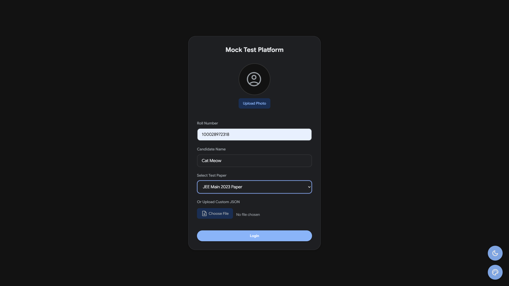
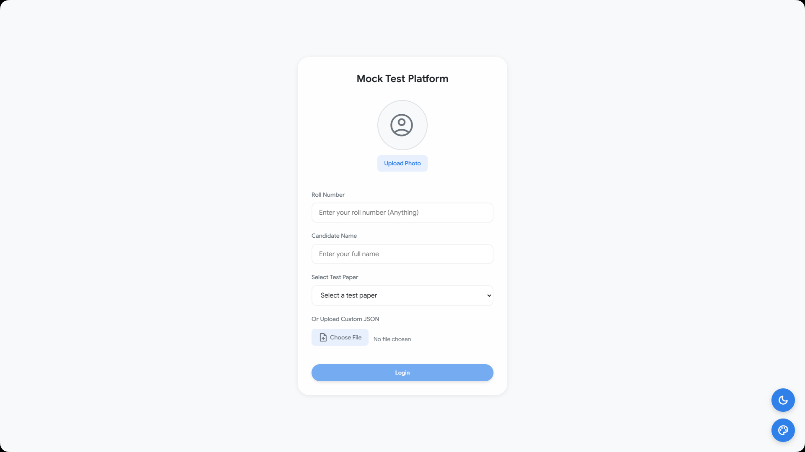
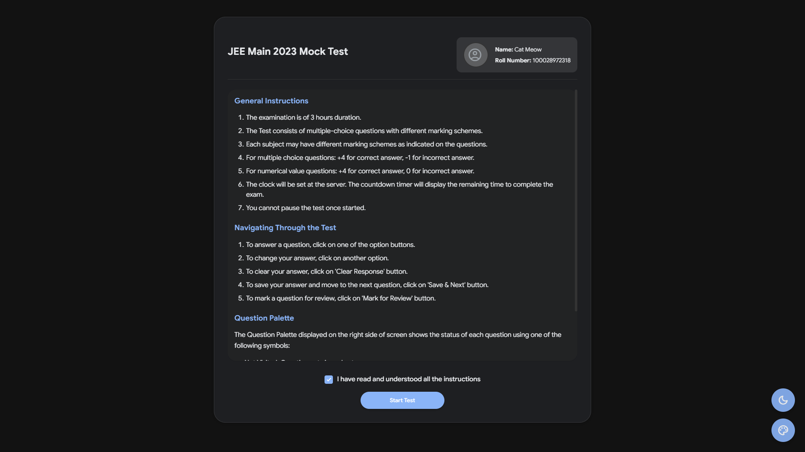
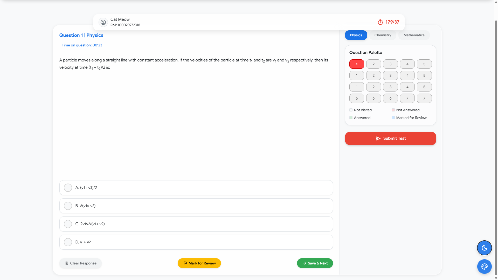
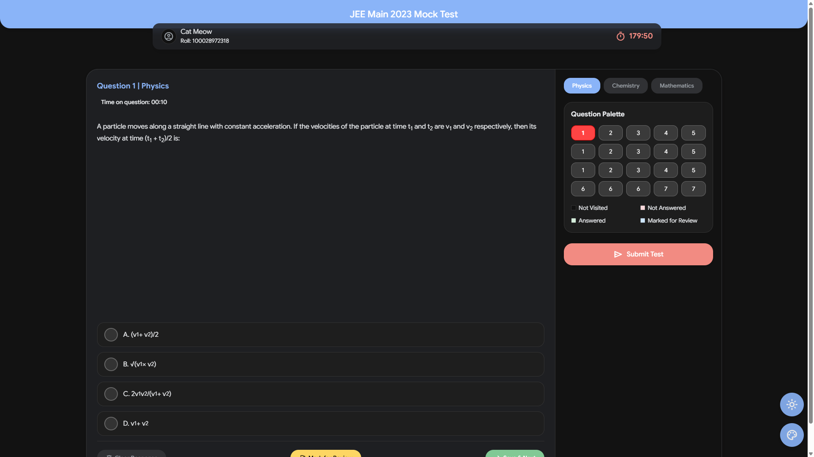
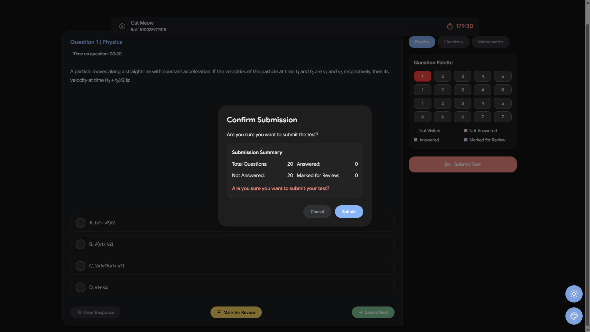
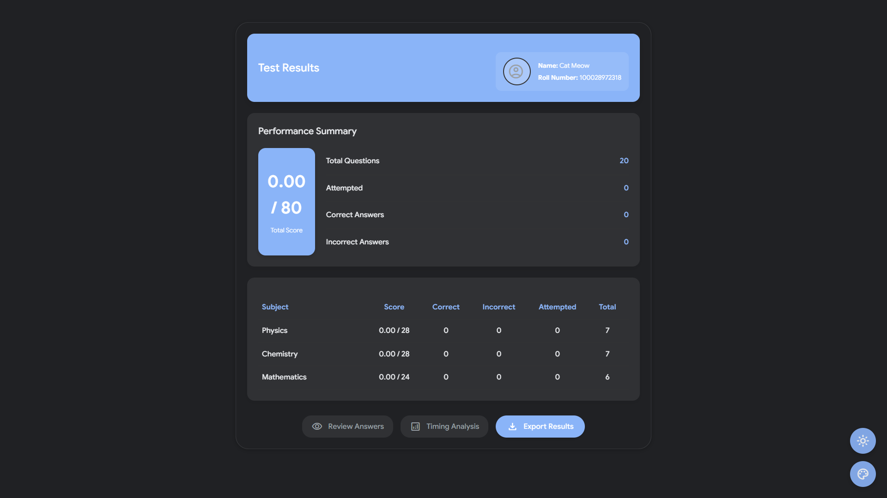
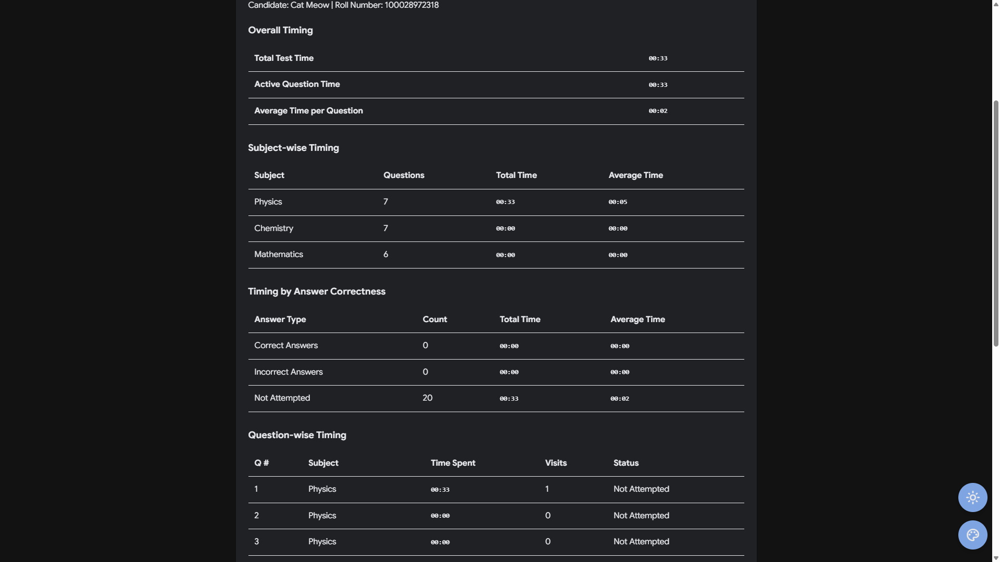
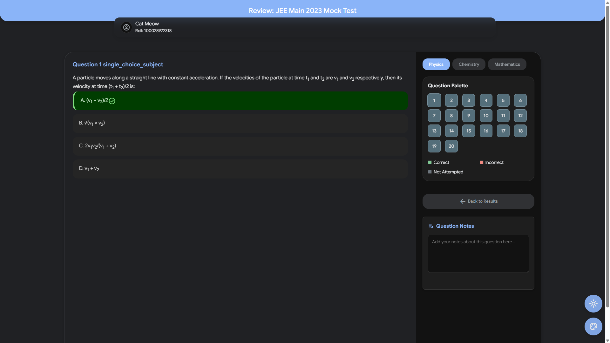

# Meow-Mocks

Yo! So u wanna build ur own digital fight club for brainy peeps? Or maybe u just dig that JSON smell, idk. Anyway, u stumbled on the **Mock Test Platform** – it's this web app, kinda vibey, lets u run mock tests. Think NTA, but like, with ur own Qs and hopefully less server meltdowns. No cap.

This thing's ur sandbox. Take tests, fry ur brain, then check out how smart (or not so smart, lol) u or ur users are with the fancy charts(charts functionality not implemented).

## Screenshots

### Login Screen


*The epic login screen where users enter their deets and upload pics*

### Instructions Page

*Rules and stuff that users probably won't read lol*

### Exam Interface


*Where the magic happens - answering questions with swag*

### Results Page


*The moment of truth - see if you're big brain or not*

### Analysis Screen

*Charts and graphs to flex your performance*

### Review Feature

*Jot down thoughts that'll make you go "what was I thinking?" later*

## Wut's Inside? (Da Featurez, fam!)

*   **Who Dis? (User Login)**: Peeps sign in w/ name, roll num, & can even upload a pic (cat pics welcome, we ain't judgin').
*   **Pick Ur Poison (Test Selection)**: Load tests from our sample JSON or go wild & upload ur own custom-made question soup.
*   **Da Rulez (Instructions Page)**: B4 the chaos, users gotta pinky swear they read the rules. Standard stuff, iykyk.
*   **Da Arena (Exam Interface)**:
    *   **Tic-Toc!**: Real-time timer to get that heart rate up.
    *   **Question Tsunami**: Loads Qs on the fly – text, big brain MathJax stuff, & pics (if u got 'em).
    *   **One or Many?**: Does MCQs - single or multi-correct. Keeps it spicy.
    *   **Subj Hop**: Quick tabs to jump between subjects. Speedy!
    *   **Color Palette o' Doom**: Shows Q status: Answered, Not Answered, Marked for Review, & the scary Not Visited. More colors than my last art project.
    *   **Oopsie Buttons**: "Clear Response" (for when u goof), "Mark for Review" (for the indecisive), & "Save & Next" (no goin' back... till the next Q).
    *   **Brain Dumps (Notes Feature, in review mode)**: Lil notepad for each Q. Autosaves, cuz who hits save when panicking? Exportable too, if u wanna show off ur notes.
*   **"I'M OUT!" (Submission)**: Submit like a G, or let the timer do its thing when time's up. Drama!
*   **Post-Mortem (Results Page)**: Get the deets – score, time, & how u did vs. the right answers. The tea, basically.
*   **Charty Party(not implemented rn) (Perf Analysis)**: Cool graphs (shoutout Chart.js!) showin' off ur skills. Data can be kinda pretty, ngl.
*   **Take It To Go (Export)**: Export ur awesome results & notes.
*   **Mood Swings (Themes)**: Light mode, dark mode, other themes? We got buttons for dat.
*   **Fresh Fixes & Stuff**:
    *   Note Export: Actually exports *all* ur notes now. Big W.
    *   Console Gremlins: Told some errors to touch grass.
    *   Exam Autosave: That old feature? It's ghosted us. Simpler life. (Notes still autosave, chill!).

## Da Map (Directory Structure)

Lost? Here's how it's laid out. `index.html` is where the party's at.

```
NTA MOCK/
├── css/                  # Styles n stuff. Tryna make it look not-mid.
│   ├── main.css
│   ├── login.css
│   └── ... (other css files that do things)
├── images/               # For pics. Kinda empty rn, feeling shy.
├── js/                   # JavaScript magic (or madness) happens here.
│   ├── main.js
│   ├── login.js
│   ├── exam.js
│   └── ... (more js files, doin' their best)
├── index.html            # THE ONE. Click this bad boy.
├── sample_test_jee.json  # Ur first victim... I mean, test file.
└── README.md             # U R HERE. Reading my glorious typos.
```

## Let's Get This Bread! (Runnin' the App)

Just go to : rtx09x.github.io/Meow-Mocks

Or

U wanna run this on ur comp? Sick! Easier than parallel parking, fr.

### Wat U Need:

*   A browser that ain't from the stone age (Chrome, Firefox, Edge, u get it).
*   These files (Clone it if it's on GitHub, or just DL the ZIP, whatevs).

### How to Fire It Up:

1.  **Unzip It**: If u got a ZIP, extract it somewhere cool.
2.  **Double Clicky**: Go to the folder & just double-click `index.html`. Ur browser should show the login page. Ez pz.
3.  **Level Up (Optional but kinda smart)**:
    *   To make it run smooth & avoid browser drama with file paths, use a local web server.
    *   **How tho?** If u use VS Code, get an extension called "Live Server." Install, right-click `index.html`, pick "Open with Live Server." Bam! Ur a pro now.

## Da Secret Recipe: Makin' Ur Own Tests (JSON Structure)

Wanna cook up ur own tests? Bet. This thing munches JSON. Check `sample_test_jee.json` to see how it's done.

Suggestion : Take any ai tool, prefferably aistudio.google.com and choose gemini2.5flash, upload your questionpaper pdf, and copy this readme and paste it, and the sample json files, ill add in here, tell it to give a test for you, wait till it spits out json file, copy and use, it works 99% of the time, otherwise link this repo and ask ChatGPT!

Here's what a Q looks like in the JSON:

```json
{
  // ... other test deets like title, totalTime, etc. ...
  "questions": [
    {
      "id": "q1", // Unique ID, make it snappy (string)
      "subject": "Fysiks", // Wat subject dis is (string)
      "text": "If a birb flies at 20km/h... wut's ur fav pizza topping?", // Da question itself (string)
      "image": "img/questions/sum_pic.png", // Optional: path to a pic (string)
      "options": {
        "A": "Pepperoni",
        "B": "Pineapple (fight me)",
        "C": "Cheese, just cheese",
        "D": "All of the above"
      }, // Choices, choices (object)
      "correctAnswer": "A", // Which one is right (string, or array for multi-correct)
      "type": "single", // "single" or "multiple" (string)
      "marks": 4, // Pointz for gettin' it right (number)
      "negativeMarks": 1 // Oof, points u lose for wrong guess (number, usually positive)
    }
    // ... moar questions ...
  ]
}
```

### Pics (High Maintenance, tbh):

*   **Question Pics**: If ur Q has an `image`, the app looks for it like `img/questions/ur_pic.png`. Make sure `img/questions/` is at the root (next to `index.html`) & has ur pics. Or else, u get ugly broken pic icons. Sad!
*   **Ur Face (Candidate Photo)**: Users can upload. If not, placeholder. The app *might* look for `img/candidate-photo.jpg`. To avoid 404s, maybe put a default tiny pic there. Just sayin'.

## Tech We Used (Da Spells)

*   **HTML5**: Da bones.
*   **CSS3**: Da drip (tryna make it look good).
*   **JavaScript (ES6+)**: Da brains & muscle. Does the heavy lifting.
*   **Chart.js**: For when u need a graph to show ur epicness.
*   **MathJax**: Makes `E=mc²` look like `E=mc²` & not like my cat walked on the keyboard.

## Side Quests (Known Issues & Stuff to Fix L8r)

Nothin's perfect, not even this masterpiece. Here be some stuff that's a bit janky:

*   **Ghost Pics**: App throws a fit (404 errors) if it can't find pics from ur test data (like `img/questions/missing_cat_meme.png`) or that `img/candidate-photo.jpg`.
    *   **Easy Fix**: Be a legend & make sure ur pics are in `img/` and `img/questions/` folders at the root.
    *   **Future Glow-Up**: Someone (u?) could teach the JS to be chill about missing pics – show a placeholder or somethin', not just a broken link. That'd be pretty rizz.

## Wanna Help? (Contributing)

Think u can make this even better/weirder? Contributions are totally welcome! Fork it, branch it, do ur thing. Let's make it less mid, together!

---

